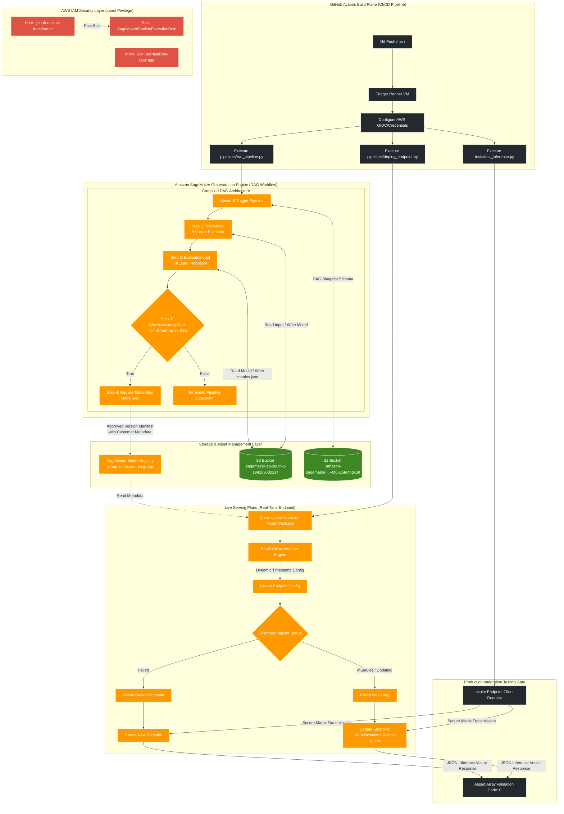
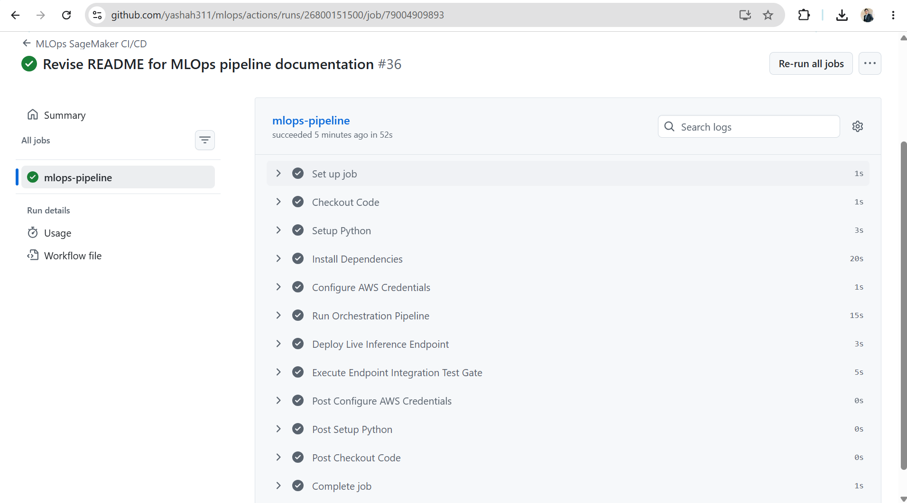
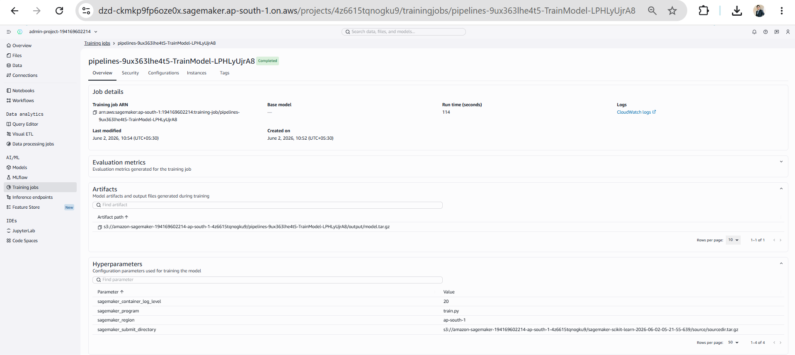
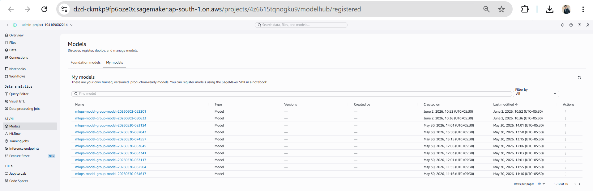
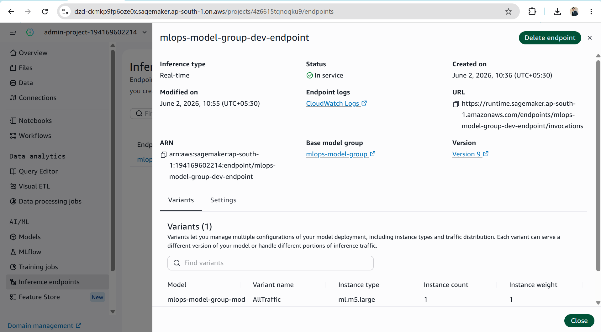

# Enterprise End-to-End MLOps Pipeline on AWS SageMaker

An production-grade, asynchronous machine learning operations framework utilizing **Amazon SageMaker Pipelines** and **GitHub Actions** for secure, automated continuous integration and continuous delivery (CI/CD). 

This architecture enforces strict isolation between machine learning logic and cloud infrastructure management configurations, applies granular, least-privilege identity access management, guarantees zero-downtime rolling deployments, and incorporates automated evaluation gates.

---

## 🏗️ Architectural Topology & System Flow

```text
[GitHub Plane] ──(OIDC Token)──> [IAM Security Gateway]
                                          │
    ┌─────────────────────────────────────┴─────────────────────────────────────┐
    ▼                                                                           ▼
[pipelines/run_pipeline.py]                                        [pipelines/deploy_endpoint.py]
    │                                                                           │
    ▼                                                                           ▼
[SageMaker Pipeline Session Engine]                               [Boto3 Active Deployment Layer]
    │                                                                           │
    ├── Step 1: Training Job (train.py)                                         ├── Parse Registry Package Metadata
    ├── Step 2: Processing Evaluation (evaluate.py)                             ├── Generate Timestamped Configurations
    └── Step 3: Condition Check (Accuracy >= 80%)                               ├── Evaluate Infrastructure Health Status
               ├── Pass ──> [Register Model Package in Registry]                └── Execute Zero-Downtime Rolling Update
               └── Fail ──> [Halt Pipeline Lifecycle]                                   │
                                                                                        ▼
                                                                           [tests/test_inference.py]
                                                                           └── Smoke Test E2E Payload Validation
```




---

## ⚡ Key Architectural Features & Design Choices

### 1. Decoupled Code & Infrastructure Configuration
ML application logic resides strictly inside the `src/` directory, while deployment configurations are parameterised using a centralized configuration model (`config/pipeline_config.yaml`). This pattern ensures clean environments, mitigates dependency drift, and allows for seamless changes to infrastructure types without touching execution code.

### 2. Resolution of the SageMaker `/ping` Root Defect
Standard SageMaker pipeline registrations (`RegisterModel`) pull raw output files directly from the execution file layers, stripping away deployment handler dependencies. 

This pipeline design re-architects this layout to implement the `sagemaker.workflow.model_step.ModelStep` combined with the `PipelineSession` framework. By injecting serving variables (`SAGEMAKER_PROGRAM`) natively inside the `SKLearnModel` definition, configuration data maps correctly inside the registry metadata. This ensures that the Gunicorn processes locate the custom execution modules instantly and clears the `/ping` container health check error.

### 3. Native Processing & Condition Evaluation Gates
A dedicated `ProcessingStep` extracts performance metrics into a standardized JSON report on S3. A subsequent `ConditionStep` handles routing logic: model metadata packages are only approved and moved to the registry if performance meets or exceeds the required threshold (e.g., 80% accuracy).

### 4. Dynamic Rolling Deployments with Boto3 Orchestration
Rather than using high-level SDK abstractions that obscure infrastructure dependencies, `pipelines/deploy_endpoint.py` uses raw `boto3` parameters. This configuration implements an enterprise-ready continuous delivery flow:
* **Config Immutability Handling:** Every deployment run generates an immutable, timestamped endpoint configuration to prevent naming collisions.
* **Resilient State Management:** The deployment layer checks the active health status of existing infrastructure before running changes. It automatically deletes failed resources to clear the workspace and polls busy updates smoothly.
* **Zero-Downtime Blue/Green Updates:** Updates are sent to the production endpoints as managed rolling updates, shifting incoming requests cleanly across active hosts without down-time.

---

## 🛠️ Pipeline Implementation & Visual Verification

### Step 1: GitHub Actions Continuous Integration Trigger
Every code change merged into the target branch starts the workflow runner. The workflow securely assumes roles through an OpenID Connect (OIDC) connection token without requiring persistent AWS Access Keys.

<!-- PLACEHOLDER: Upload a screenshot of your successful GitHub Actions build execution steps here -->


### Step 2: Managed Orchestration via SageMaker Pipelines
The SageMaker orchestration engine converts your Python scripts into a directed execution workflow. 

<!-- PLACEHOLDER: Upload a screenshot from your AWS SageMaker Studio Console showing the completed pipeline execution graph here -->


### Step 3: Model Lineage Tracking & Registry Storage
Models that surpass the performance gate threshold appear in the central model registry group. This records execution parameters, evaluation values, and validation matrices.

<!-- PLACEHOLDER: Upload a screenshot of your AWS SageMaker Model Registry console showing the approved versions here -->


### Step 4: Real-Time Blue/Green Inference Endpoint Deployment
The deployment engine acts as a continuous delivery worker. It references structural registry values, processes live traffic updates, and changes infrastructure settings with zero system downtime.

<!-- PLACEHOLDER: Upload a screenshot of your active AWS SageMaker real-time inference endpoint configuration here -->


---

## 🔒 Security Hardening & IAM Governance

This infrastructure enforces a zero-trust model. The automated GitHub Actions runner authenticates using scoped programmatic access configurations, blocking access to unrelated account components.

### 1. Minimal-Access Programmatic User Policy
Attach this policy directly to your automation user (`github-actions-transformer`) to grant the specific pipeline management capabilities required for compilation and orchestration tasks:

```json
{
	"Version": "2012-10-17",
	"Statement": [
		{
			"Sid": "SageMakerPipelineAndEndpointManagement",
			"Effect": "Allow",
			"Action": [
				"sagemaker:CreateTrainingJob",
				"sagemaker:DescribeTrainingJob",
				"sagemaker:CreateProcessingJob",
				"sagemaker:DescribeProcessingJob",
				"sagemaker:CreateModel",
				"sagemaker:DescribeModel",
				"sagemaker:DeleteModel",
				"sagemaker:CreateModelPackage",
				"sagemaker:DescribeModelPackage",
				"sagemaker:ListModelPackages",
				"sagemaker:CreateModelPackageGroup",
				"sagemaker:DescribeModelPackageGroup",
				"sagemaker:ListModelPackageGroups",
				"sagemaker:CreateEndpointConfig",
				"sagemaker:DescribeEndpointConfig",
				"sagemaker:DeleteEndpointConfig",
				"sagemaker:CreateEndpoint",
				"sagemaker:DescribeEndpoint",
				"sagemaker:UpdateEndpoint",
				"sagemaker:DeleteEndpoint",
				"sagemaker:ListEndpoints",
				"sagemaker:CreatePipeline",
				"sagemaker:UpdatePipeline",
				"sagemaker:StartPipelineExecution",
				"sagemaker:DescribePipeline",
				"sagemaker:DescribePipelineExecution",
				"sagemaker:ListPipelineExecutions",
				"sagemaker:AddTags",
				"sagemaker:InvokeEndpoint"
			],
			"Resource": [
				"arn:aws:sagemaker:ap-south-1:194169602214:training-job/*",
				"arn:aws:sagemaker:ap-south-1:194169602214:processing-job/*",
				"arn:aws:sagemaker:ap-south-1:194169602214:model/*",
				"arn:aws:sagemaker:ap-south-1:194169602214:model-package-group/*",
				"arn:aws:sagemaker:ap-south-1:194169602214:model-package/*",
				"arn:aws:sagemaker:ap-south-1:194169602214:endpoint-config/*",
				"arn:aws:sagemaker:ap-south-1:194169602214:endpoint/*",
				"arn:aws:sagemaker:ap-south-1:194169602214:pipeline*"
			]
		},
		{
			"Sid": "S3BucketAndArtifactAccess",
			"Effect": "Allow",
			"Action": [
				"s3:GetObject",
				"s3:PutObject",
				"s3:ListBucket",
				"s3:DeleteObject",
				"s3:GetBucketLocation"
			],
			"Resource": [
				"arn:aws:s3:::sagemaker-ap-south-1-194169602214",
				"arn:aws:s3:::sagemaker-ap-south-1-194169602214/*",
				"arn:aws:s3:::amazon-sagemaker-194169602214-ap-south-1-4z6615tqnogku9",
				"arn:aws:s3:::amazon-sagemaker-194169602214-ap-south-1-4z6615tqnogku9/*"
			]
		}
	]
}
```

### 2. User Inline Policy: Secure Role Delegation Cross-Boundary
To protect against privilege escalation attacks, AWS explicitly prevents standard IAM users from configuring or assigning execution capabilities that exceed their own security boundaries. 

This project solves this by attaching a granular `iam:PassRole` inline block to the programmatic user account. This explicitly allows it to pass only the specific, scoped service role (`SageMakerPipelineExecutionRole`) containing `AmazonSageMakerFullAccess` to the underlying compute instances, while explicitly restricting it from passing broader administrative credentials:

```json
{
	"Version": "2012-10-17",
	"Statement": [
		{
			"Sid": "DirectGitHubPassRoleOverride",
			"Effect": "Allow",
			"Action": "iam:PassRole",
			"Resource": [
				"arn:aws:iam::194169602214:role/service-role/SageMakerPipelineExecutionRole"
			],
			"Condition": {
				"StringEquals": {
					"iam:PassedToService": "://amazonaws.com"
				}
			}
		}
	]
}
```

---

## 🛠️ Operational Deployment & Execution Guide

### Local Evaluation & Interactive Testing
To run workflow steps manually or inspect performance characteristics inside an integrated development workspace (such as SageMaker Studio Notebook cells):

```bash
# Initialize project requirements
pip install -r requirements.txt

# Compile, upsert, and run the pipeline configuration asynchronously
python pipelines/run_pipeline.py

# Poll registry changes and trigger a rolling update deployment
python pipelines/deploy_endpoint.py

# Execute smoke validation scripts against active endpoints
python tests/test_inference.py
```

### Git Automation Flow
The active configuration uses a hands-free integration path triggered on code changes to the primary repository branch. To release changes:

```bash
git add .
git commit -m "feat: incorporate end-to-end operational code refactoring fixes"
git push origin main
```
Track live build container tracking metrics and workflow progress directly under your repository's **GitHub Actions Console Dashboard**.
